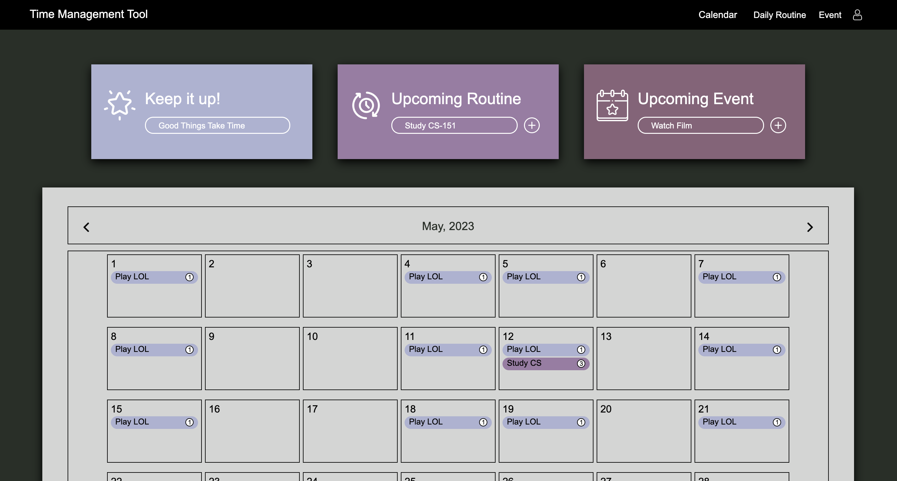
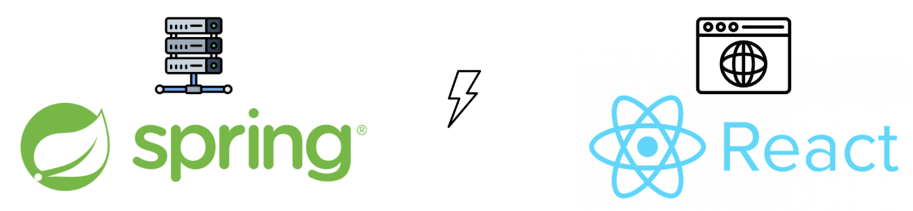
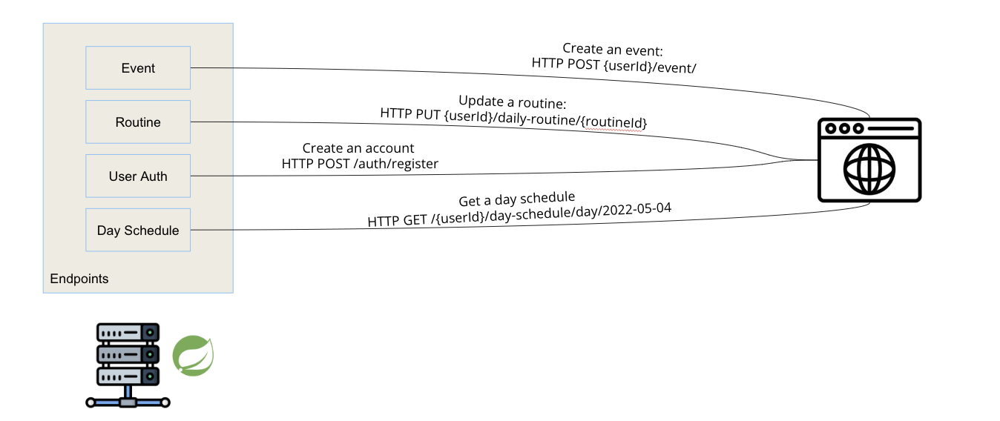
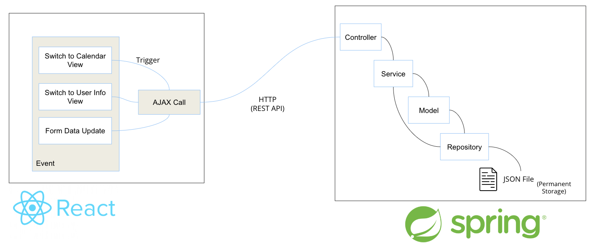
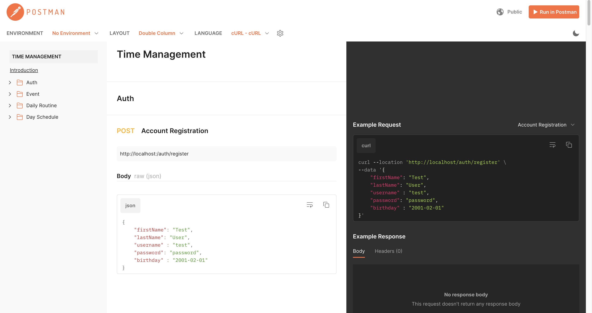

# Time Management



**Demo Video on YouTube**
https://youtu.be/7xLJknSHdqA


## Running the application
You should have both frontend and backend running at the same time to get the application works properly.

### Download
```zsh
git clone https://github.com/ansleehk/CS151-TimeManagement.git
cd CS151-TimeManagement
```

### Frontend
```zsh
cd frontend
npm install
npm run start
```

**Default running port:** 3000

#### Frontend Preview Server

This is not the production server. This server is used for previewing the frontend design. It does not connect to our backend service.
https://cs151-time-management.pages.dev/

### Backend

You should have Maven installed on your machine.

To install Maven on a Mac:
```zsh
brew install maven
```

```zsh
cd backend
mvn spring-boot:run
```


**Default running port:** 8010

## Architecture

### Tech Stack


We utilize Java Spring framework to build the backend and JavaScript ReactJs framework to build the frontend.

### API Endpoints


We utilize the REST API way to allow frontend and backend communication with each other.

Four endpoints are established to allow data flow between frontend and backend.
- Event: CRUD events.
    - Path: /{{userId}}/event
- Routine: CRUD schedules.
    - Path: /{{userId}}/daily-routine/
- Day Schedule: Fetch scheduled schedules
    - Path: /{{userId}}/day-schedule/
- User Authentication: Account registration and login
    - Path: /auth/

### Data Flow


#### Partially Utilizing MVC
Our design does not strictly follow the MVC pattern. However, the basic structure is the same.

##### View (V)
ReactJs is the view for rendering the data.

##### Controllers (C)
Controllers are the endpoints of the backend.

##### Models (M)
- Activity
    - Event
    - DailyRoutine
- DaySchedule
- ScheduledDayActivity
- User

## Development

### API Documentation



URL: https://documenter.getpostman.com/view/20961535/2s93ebUX5S

### Testing API with Postman

**Download the collection for testing the API with Postman**

[Download Postman Collection](/proposal/api/Time%20Management.postman_collection.json)

### Change the port

PORTs are set to be easily manipulated. They are saved in two .env files.

Frontend
```zsh
nano frontend/.env
// Locate the REACT_APP_SERVER_URL variable and change it
```

Backend
```zsh
nano backend/src/main/resources/application.properties
// Locate the server.port variable and change it
```